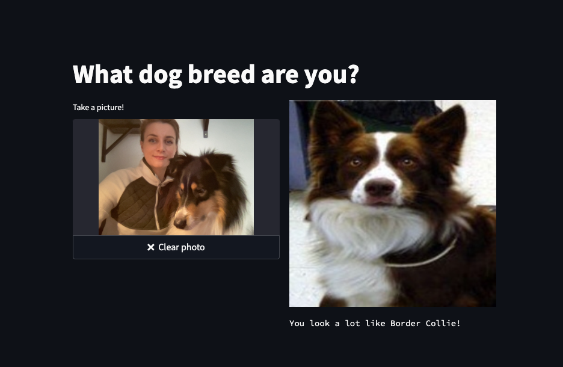

# dog-breed-streamlit-app

## Steps:

## 1. Go to vectorize_dataset.ipynb

- read the code and run the notebook
- fill the missing lines
- check the shape of vectors dataframe - how many images do we have in the dataset?
- make sure that vectors.parquet was created

## 2. Go to src.helpers.py

- fill the missing lines in predefined functions

## 3. Go to app.py

- with the help of documentation https://docs.streamlit.io/library/get-started/create-an-app and comments create your streamlit application!

#### **Hint**

_In case you get stuck or you need an inspiration, take a sneak peek into the /answers/ folder_

---

## Too easy? Try adding more complexity!

    # enrich the page layout, add texts, input fields, result metrics - be creative :)

    # add cats dataset from https://www.kaggle.com/datasets/ma7555/cat-breeds-dataset - ask the user if he/she/it is a cat or dog person and display the result image based on the answer

    # push your project into GitHub repository and deploy your app to streamlit cloud https://streamlit.io/cloud

    # or simply publish your Deepnote project and share it around!
